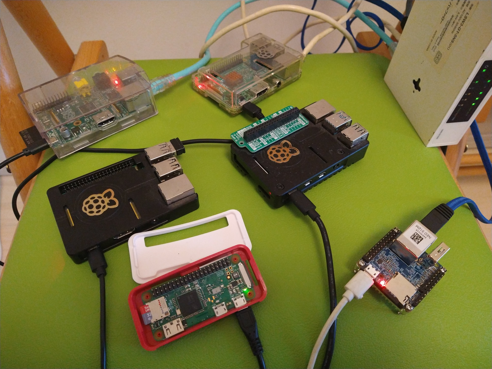
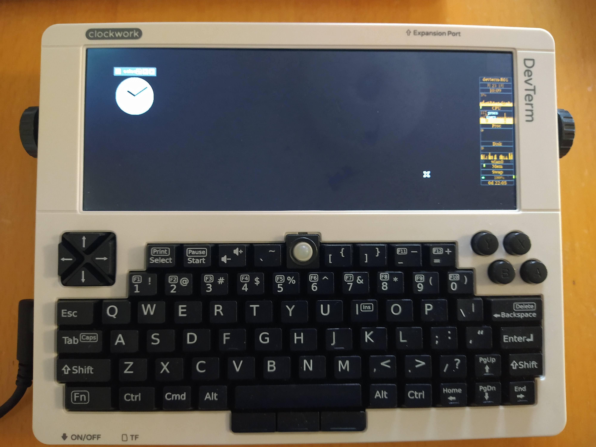
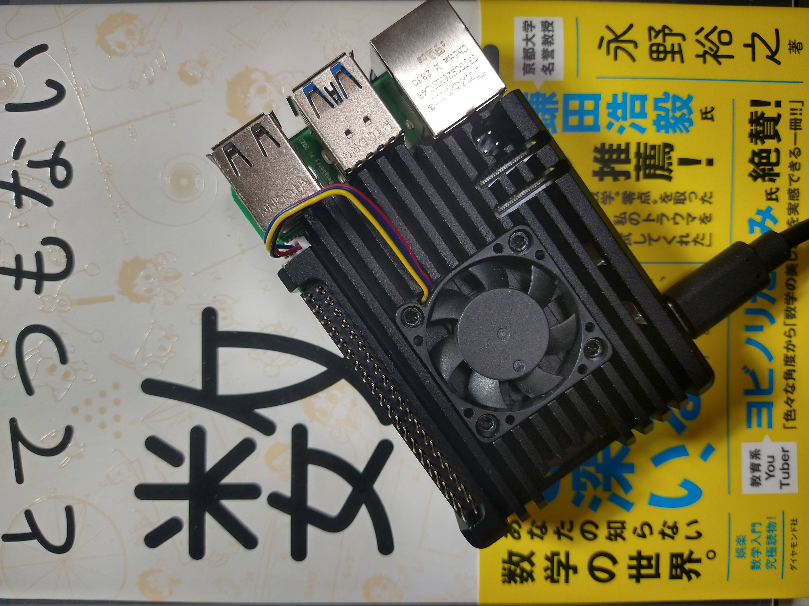

# pi

1. mpfr pi定数 ・・・・・・・・・・・・・・・・・・・・・ [pi_cons](pi_cons)
2. mpfr arctan(1)  ・・・・・・・・・・・・・・・・・・・・ [pi_atan](pi_atan)
3. 算術幾何平均 (AGM ; Arithmetic and Geometric Mean) ・・ [pi_agm](pi_agm)

    [2003 Hironobu SUZUKI]　(リンク切れ)(2003)　[suzuki](suzuki)
 
4. Machin's formula  ・・・・・・・・・・・・・・・・・・・ [machin](machin)
5. strange π approximation ・・・・・・・・・・・・・・・・ [pi_ln](pi_ln)
6. Chudnovsky Binary Splitting Method ・・・・・・・・・・

    [円周率を1億桁計算しました！ － その試行錯誤の詳しい経緯と結果 －](https://itchyny.hatenablog.com/entry/20120304/1330870932)(2014)　[itchyny](itchyny)
    
    [Rustを使って円周率1億桁計算したお話](https://zenn.dev/uu/articles/48e2d4098b6aca)(2021)　[yapatta](yapatta)
    
    [Chudnovsky の公式を用いた円周率の計算用メモ](https://qiita.com/peria/items/c02ef9fc18fb0362fb89)

7. Million Digit Pi Benchmark

[すずきひろのぶ氏の円周率１００万桁ソースコード](suzuki)を用いて各世代RaspberryPiの速度比較を行う。

|Hardware|Central Processing Unit|Operating System|gcc|gmp|time|
|---|---|---|---|---|---:|
|ThinkPad P71 (2018) |Core i7-7820HQ 2.9GHz|Debian(stretch) /WSL/Windows10|6.3.0|6.2.1|  0.993s|
|HP EliteBook 630 G9 (2023) |Core i5-1235U 1.3GHz|Debian(bookworm) /WSL/Windows11|12.2.0|6.2.1|  1.000s|
|ThinkPad E14-i3 (2021) |Core i3-1115G4@ 3.00GHz|Debian(bullseye) /WSL/Windows11|10.2.1|6.2.1|  2.135s|
|Raspberry Pi 5 8GB (2024)|ARM Cortex-A76 2.4GHz|RaspberryPiOS (Debian 12 (bookworm))|12.2.0|6.3.0|	2.200s|
|Raspberry Pi 400 (2021)|ARM Cortex-A72 1.8GHz|RaspberryPiOS (Debian 11 (bullseye))|10.2.1|6.2.1|	4.054s|
|Raspberry Pi 4 Model B Rev 1.2 (2019)|ARM Cortex-A72 1.5GHz|RaspberryPiOS (Debian 11 (bullseye))|10.2.1|6.2.1|	4.875s|
|VisionFive2 (2022)|StarFive JH7110 (U74 4 Core 1.5GHz) RV64GC|Debian GNU/Linux trixie/sid|13.1.0|6.3.0| 8.895s|
|Raspberry Pi 3 Model B Rev 1.2 (2016)|ARM Cortex-A53 1.2GHz|RaspberryPiOS (Debian 11 (bullseye))|10.2.1|6.2.1|13.826s|
|NanoPi NEO (2016)|Allwinner H3 (Quad-core Cortex-A7) 1.2GHz|Ubuntu 16.04.7 LTS|5.4.0|6.2.1|21.383s|
|Raspberry Pi 2 Model B Rev 1.1 (2015)|ARM Cortex-A7 900MHz|RaspberryPiOS (Debian 11 (bullseye))|10.2.1|6.2.1|21.798s|
|DevTerm R-01 (2022)|RISC-V 64bit Single-core 1.0GHz RV64IMAFDCVU|Ubuntu 22.04.1 LTS|11.3.0|6.2.1|32.788s|
|Raspberry Pi Zero Model B Rev 2 (2018)|ARM1176JZF-S 1GHz|RaspberryPiOS (Debian 11 (bullseye))|10.2.1|6.2.1|33.960s|
|Raspberry Pi Model B Rev 2 (2012)|ARM1176JZF-S 700MHz|RaspberryPiOS (Debian 11 (bullseye))|10.2.1|6.2.1|48.573s|

左上から raspberry pi (初代)、raspberry pi 2。中段左から raspberry pi 3、raspberry pi 4。下段左から raspberry pi Zero、NanoPi NEO。

DevTerm R-01

RaspberryPi5

